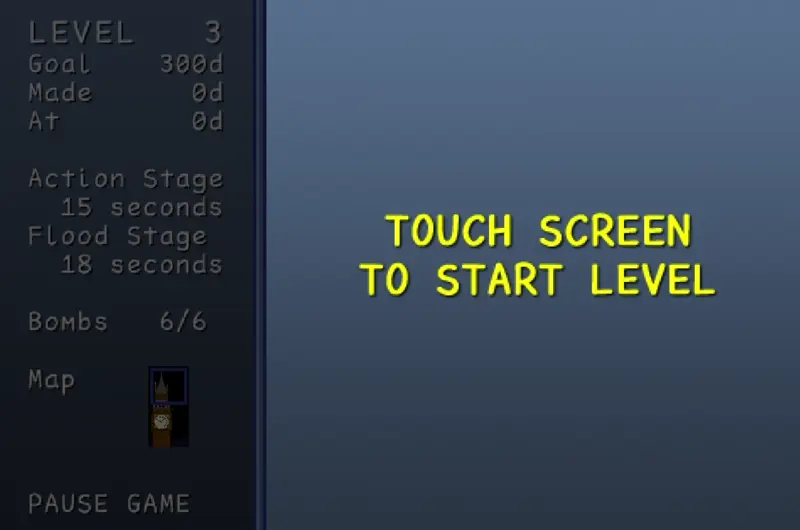

# WATER

Written in App Game Kit Classic (v1.7), WATER was inspired by the DOS puzzle game [H2O](https://www.youtube.com/watch?v=zf-pR9MNmMI) and released for iOS, Android, and Windows in 2011.

## Screenshots

## License

Due to licensing issues, all music has been stripped from the app. Only incidental sound effects remain.

---

This work is licensed under a
[Creative Commons Attribution-ShareAlike 4.0 International License][cc-by-sa].

[![CC BY-SA 4.0][cc-by-sa-image]][cc-by-sa]

[cc-by-sa]: http://creativecommons.org/licenses/by-sa/4.0/
[cc-by-sa-image]: https://licensebuttons.net/l/by-sa/4.0/88x31.png
[cc-by-sa-shield]: https://img.shields.io/badge/License-CC%20BY--SA%204.0-lightgrey.svg